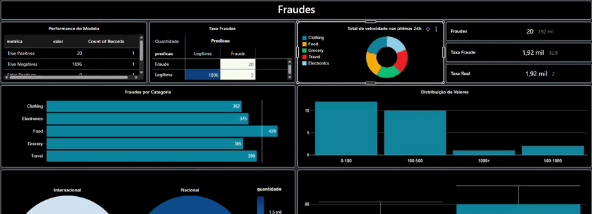

# Detecção de Fraudes em Transações Financeiras com PySpark

<p align="center">
  
  
  
  <br/>
  
  
  
</p>

<p align="center">
Sistema de detecção de fraudes em transações financeiras utilizando <b>Apache Spark</b>, <b>PySpark MLlib</b> e técnicas de Machine Learning.
</p>

---

## Visão Geral

Fraudes financeiras representam bilhões em perdas todos os anos para instituições financeiras. Detectar transações suspeitas de forma rápida e precisa é essencial para reduzir prejuízos e proteger clientes.

Este projeto implementa um **pipeline completo de Machine Learning utilizando Apache Spark**, capaz de processar grandes volumes de transações e identificar padrões associados a fraudes.

A solução inclui:

• Processamento distribuído com Apache Spark  
• Engenharia de features para detecção de comportamentos suspeitos  
• Treinamento de modelos de Machine Learning com PySpark MLlib  
• Avaliação de performance do modelo  
• Dashboard analítico para visualização dos resultados  

O modelo final alcançou **99,93% de AUC‑ROC**, demonstrando excelente capacidade de identificar fraudes.

---

## Problema de Negócio

Sistemas de detecção de fraude precisam equilibrar dois objetivos principais:

• Detectar o maior número possível de fraudes  
• Reduzir falsos positivos que impactam clientes legítimos  

Uma solução eficiente reduz perdas financeiras e melhora a experiência do cliente.

---

## Resultados Principais

<p align="center">

| Métrica | Resultado |
|:-------:|:---------:|
| **AUC-ROC** | 99.93% |
| **Accuracy** | 99.74% |
| **Precision (Fraude)** | 100% |
| **Recall (Fraude)** | 80% |
| **F1-Score** | 99.73% |

</p>

### Impacto Prático

• **80% das fraudes detectadas**  
• **0% de falsos positivos** (nenhuma transação legítima marcada como fraude)  
• **5 fraudes não detectadas** (20% de falsos negativos)  
• **Precision perfeita**: quando o modelo identifica fraude, está 100% correto  

---

## Dataset

O dataset contém **10.000 transações de cartão de crédito simuladas**, incluindo características comportamentais e contextuais.

**Distribuição das classes:**

| Classe | Quantidade | Percentual |
|--------|------------|------------|
| Transações legítimas | 9.849 | 98.49% |
| Transações fraudulentas | 151 | 1.51% |

Esse cenário representa um **dataset altamente desbalanceado**, algo comum em problemas reais de detecção de fraude.

### Principais Variáveis

• `amount` — valor da transação  
• `merchant_category` — categoria do comerciante  
• `transaction_hour` — hora da transação  
• `foreign_transaction` — transação internacional  
• `location_mismatch` — inconsistência de localização  
• `device_trust_score` — confiabilidade do dispositivo  
• `velocity_last_24h` — velocidade de transações nas últimas 24h  
• `cardholder_age` — idade do titular  

**Variável alvo:** `is_fraud`

---

## Arquitetura do Sistema

O projeto segue uma arquitetura típica de **pipeline de dados e Machine Learning**.

<div align="center">

### Pipeline de Machine Learning

 
→ 
 
→ 
 
→ 


 
→ 
 
→ 
 
→ 


</div>


O uso do **Apache Spark** permite processar dados de forma distribuída, possibilitando escalar o sistema para milhões de transações.

---

## Engenharia de Features

Foram criadas **12 features** para capturar padrões de comportamento suspeitos.

### Features Criadas

• `high_value_transaction` — transações de alto valor  
• `night_transaction` — transações realizadas entre 00h e 06h  
• `amount_log` — transformação logarítmica do valor  
• `foreign_high_risk` — transação internacional realizada à noite  
• `merchant_category_index` — encoding da categoria do comerciante  
• `category_avg_amount` — média de valor por categoria  
• `amount_deviation_category` — desvio em relação à média da categoria  

Essas variáveis ajudam o modelo a detectar **anomalias no comportamento de gastos**.

---

## Comparação de Modelos

Durante o experimento, dois modelos foram avaliados:

| Modelo | AUC-ROC | Accuracy | Recall (Fraude) |
|--------|---------|----------|-----------------|
| **Logistic Regression** | 99.61% | 99.17% | 99.17% |
| **Random Forest** | 99.93% | 99.74% | 80.00% |

**Random Forest foi escolhido** por apresentar:
- Maior AUC-ROC (99.93%)
- Precision perfeita (100%)
- Zero falsos positivos

Embora o Recall seja menor (80%), a **ausência de falsos positivos** é crítica para não bloquear transações legítimas.

---

## Feature Importance

Principais variáveis utilizadas pelo modelo Random Forest:

| Feature | Importância | Percentual |
|---------|-------------|------------|
| **device_trust_score** | 0.2687 | 26.87% |
| **transaction_hour** | 0.1329 | 13.29% |
| **velocity_last_24h** | 0.1191 | 11.91% |
| **location_mismatch** | 0.1127 | 11.27% |
| **foreign_high_risk** | 0.0713 | 7.13% |

A **confiabilidade do dispositivo** é o fator mais importante para detecção de fraudes.

---

## Matriz de Confusão

### Resultados do Teste

|  | Predição: Legítima | Predição: Fraude |
|--|-------------------|------------------|
| **Real: Legítima** | 1896 | 0 |
| **Real: Fraude** | 5 | 20 |

**Interpretação:**

• **True Positives (TP):** 20 fraudes corretamente identificadas  
• **True Negatives (TN):** 1896 transações legítimas corretamente classificadas  
• **False Positives (FP):** 0 — nenhum falso alarme  
• **False Negatives (FN):** 5 fraudes não detectadas (20%)  

---

## Estrutura do Projeto

```
fraud-detection-spark/
├── data/
│   ├── raw/
│   │   └── credit_card_fraud.csv
│   └── processed/
├── notebooks/
│   ├── 01_data_ingestion.py
│   ├── 02_exploratory_data_analysis.py
│   ├── 03_feature_engineering.py
│   ├── 04_model_training.py
│   └── 05_model_evaluation.py
├── dashboard/
└── README.md
```

---

## Dashboard

Foi criado um dashboard no **Databricks** para análise dos resultados.

**Visualizações incluídas:**

• Métricas de performance do modelo  
• Matriz de confusão  
• Distribuição de fraudes por categoria  
• Análise temporal das transações  
• Distribuição de valores  
• Comparação entre transações nacionais e internacionais  
• Top transações mais suspeitas identificadas pelo modelo  

---

## Escalabilidade

O uso do Apache Spark permite:

• Processamento distribuído de grandes volumes de dados  
• Treinamento paralelo de modelos de Machine Learning  
• Integração com ambientes de produção como Databricks  
• Fácil adaptação para pipelines de dados em larga escala  

A arquitetura pode ser estendida para **detecção de fraude em tempo real**.

---

## Melhorias Futuras

Possíveis evoluções do projeto:

- [ ] Balanceamento de classes com SMOTE para melhorar Recall
- [ ] Experimentação com Gradient Boosting e XGBoost
- [ ] Otimização de hiperparâmetros com Grid Search
- [ ] Ajuste de threshold baseado em custo de negócio
- [ ] Versionamento de modelos com MLflow
- [ ] API de predição em tempo real
- [ ] Monitoramento de drift do modelo em produção

---

## Como Executar

1. Configure um ambiente Databricks  
2. Faça upload do dataset em `data/raw/`  
3. Execute os notebooks na seguinte ordem:

```
01_data_ingestion  
02_exploratory_data_analysis  
03_feature_engineering  
04_model_training  
05_model_evaluation
```

4. Dashboard para visualizar os resultados

<p align="center">
  <a href="https://youtu.be/NWRXEvl-rLQ">
    
  </a>
</p>

<p align="center">
  <a href="https://youtu.be/NWRXEvl-rLQ">
    
  </a>
</p>
---

## Conclusão

O modelo **Random Forest** alcançou resultados excepcionais:

**99.93% de AUC-ROC**  
**100% de Precision** (zero falsos positivos)  
**80% de Recall** (detecta 4 em cada 5 fraudes)  
**Excelente equilíbrio** entre detecção de fraudes e experiência do cliente  

O sistema está pronto para auxiliar na identificação de transações suspeitas, minimizando impacto em clientes legítimos.

---

## Autor

**Henrique Mourão**

<p align="center">
  <a href="https://github.com/Henrique-Mourao">
    
  </a>
  <a href="https://linkedin.com/in/henrique-mourão">
    
  </a>
  <a href="mailto:henriquegamour4@gmail.com">
    
  </a>
</p>

---

<p align="center">
  <sub>Projeto desenvolvido para fins educacionais e de portfólio</sub>
</p>
